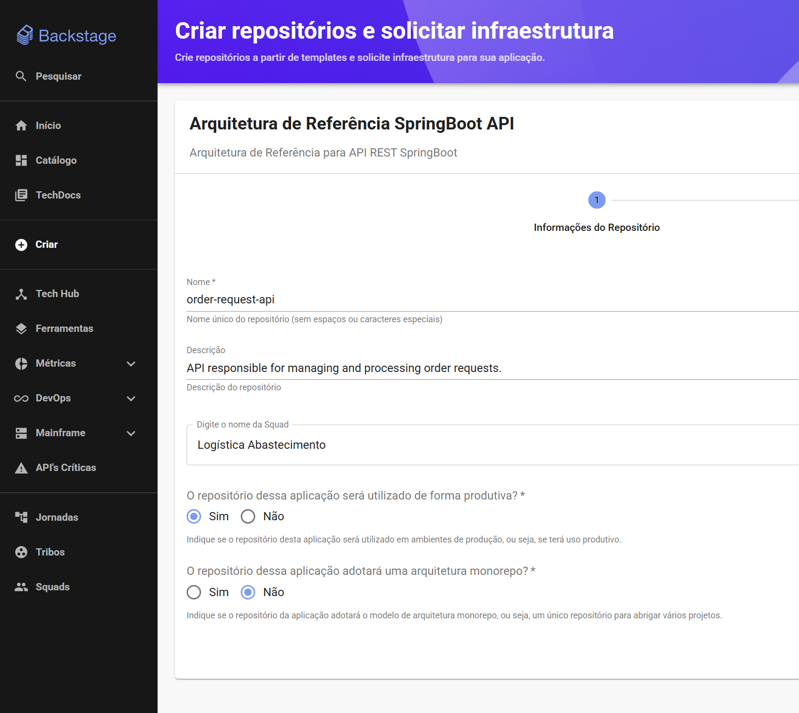
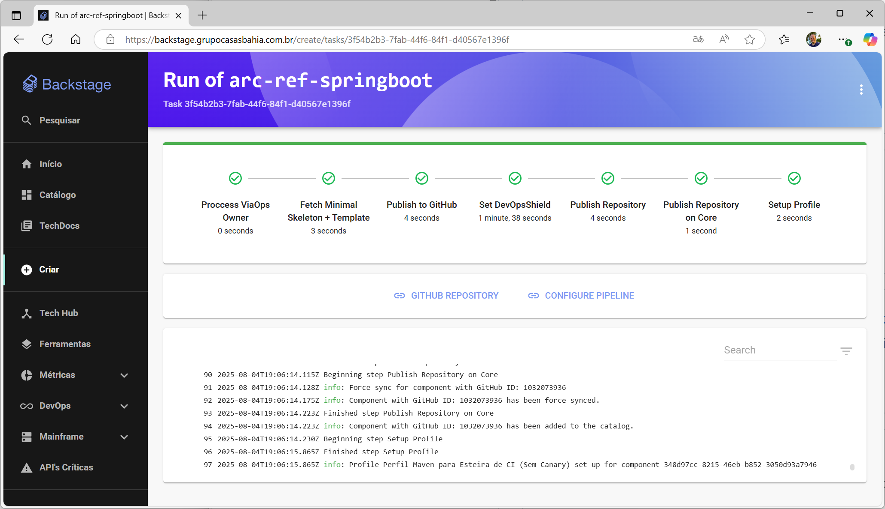
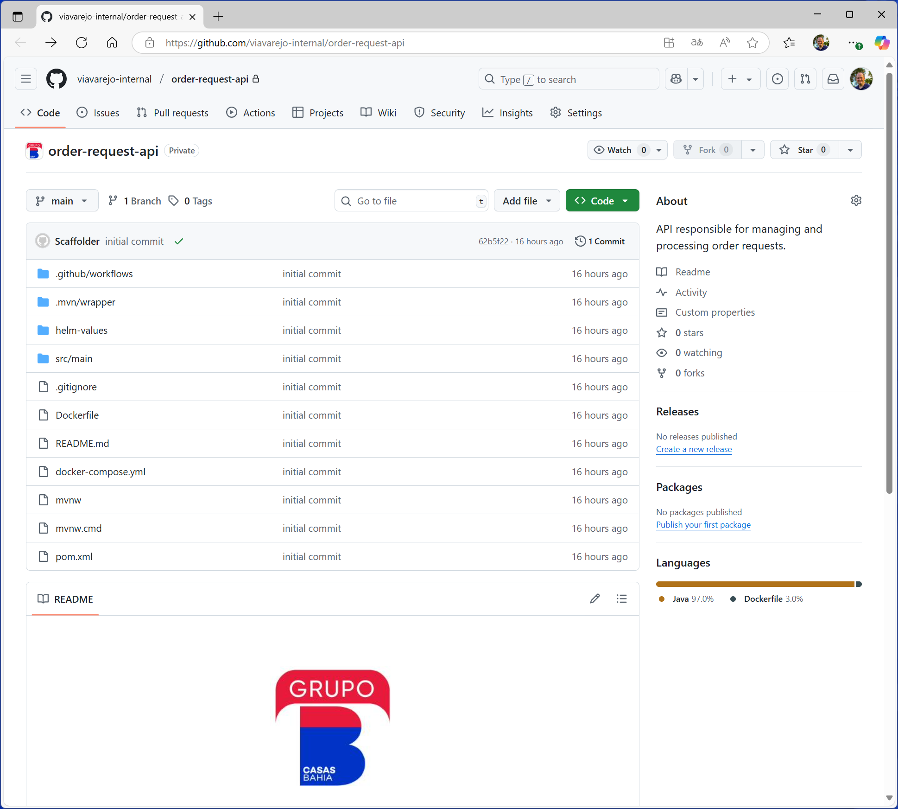

# Order Request API


## Criação do Repositório

Tarefa: [LR-4938](https://casasbahiatech.atlassian.net/browse/LR-4938)

Este repositório foi criado para atender a uma demanda específica de um projeto de Order Request API, utilizando as melhores práticas de desenvolvimento e arquitetura. A ideia é fornecer uma base sólida e escalável para o desenvolvimento de APIs RESTful, seguindo os princípios da Arquitetura Hexagonal e Clean Architecture.

## Backstage
Este repositório está integrado ao Backstage, uma plataforma de desenvolvimento de software que facilita a criação, organização e manutenção de projetos. O Backstage oferece uma interface amigável para gerenciar componentes, visualizar documentação e monitorar o estado dos serviços. A integração com o Backstage permite que a equipe tenha uma visão unificada do projeto, facilitando a colaboração e o compartilhamento de informações.

Segue o link da página da Squad de Logística Abastecimento no Backstage, onde você pode encontrar informações adicionais sobre o projeto, como documentação, status de build e deploy, e outros recursos úteis:
- [https://backstage.grupocasasbahia.com.br/catalog/default/group/squad-logistica-abastecimento](https://backstage.grupocasasbahia.com.br/catalog/default/group/squad-logistica-abastecimento)


### 🚀 Criando o Projeto no Backstage

Para criar o projeto no Backstage, siga os passos abaixo:
1. Acesse o Backstage em [https://backstage.grupocasasbahia.com.br](https://backstage.grupocasasbahia.com.br).
2. Navegue até a seção ``Componentes``.
3. Selecione a opção ``Criar Repositório``.
4. Escolha o template de projeto desejado (por exemplo, Spring Boot).
5. Preencha as informações do projeto:
   - **Nome**: order-request-api
   - **Descrição**: API responsible for managing and processing order requests.
   - **Digito o nome da Squad**: Logística Abastecimento
   - **O repositório dessa aplicação será utilizado de forma produtiva?**: Sim
   - **O repositótio dessa aplicação adotará uma arquitetura monorepo**: Não
   - **Clique em "Next"**.

      

 6. Uma sequência de passos será realizada automaticamente:
    - Criação do repositório no GitHub.
    - Configuração do pipeline de CI/CD com GitHub Actions.
    - Criação de um ambiente de desenvolvimento local com Docker.
    - Configuração de Helm para deploy em ambientes Kubernetes.
    - Ao concluir esse processo será apresentada uma tela de sucesso.

      

 7. Após a conclusão, o repositório será criado e você poderá acessá-lo diretamente no GitHub.

    - Segue o link do repositório criado para o projeto Order Request API: 
      - [https://github.com/viavarejo-internal/order-request-api](https://github.com/viavarejo-internal/order-request-api)
      
      


### 🛠️ Tecnologias Utilizadas
Este projeto utiliza uma série de tecnologias e ferramentas modernas para garantir qualidade, escalabilidade e facilidade de manutenção. Abaixo estão as principais tecnologias utilizadas:

| **Tecnologia**             | **Descrição**                                                     |
| -------------------------- | ----------------------------------------------------------------- |
| **Java 21**                | Linguagem principal utilizada no desenvolvimento                  |
| **Spring Boot**            | Framework para criação de aplicações Java modernas e desacopladas |
| **Spring Web**             | Suporte à construção de APIs REST                                 |
| **Lombok**                 | Reduz boilerplate com anotações como `@Getter`, `@Builder`, etc.  |
| **Springdoc OpenAPI**      | Geração automática de documentação Swagger para APIs REST         |
| **Spring Boot Test**       | Suporte a testes unitários e de integração com Spring             |
| **Maven Wrapper (`.mvn`)** | Facilita o build com uma versão específica do Maven               |
| **JPA / Spring Data JPA**  | Abstração para persistência de dados com bancos relacionais       |
| **H2 Database (opcional)** | Banco de dados em memória para desenvolvimento e testes           |
| **Docker / Dockerfile**    | Empacotamento da aplicação em containers                          |
| **Helm (helm-values/)**    | Gerenciamento de deploys em ambientes Kubernetes                  |
| **GitHub Actions**         | Automatização de CI/CD com workflows YAML                         |
| **Backstage**              | Plataforma de developer portal para scaffolding de novos projetos |

<br><br>

---

## 🏗️ Estrutura de Projeto: Arquitetura Hexagonal + Clean Architecture
 
Este projeto segue os princípios da **Arquitetura Hexagonal** com boas práticas de **Clean Architecture**, organizando claramente as responsabilidades de cada camada.

Este projeto segue os princípios de uma **Arquitetura Hexagonal** (também conhecida como Ports & Adapters), com influência de boas práticas de **Clean Architecture**. A ideia central é separar claramente:
- **Portas** (interfaces do domínio) e
- **Adaptadores** (implementações de infraestrutura e de API),

de forma que o **core da aplicação** (regras de negócio) fique completamente isolado de detalhes como frameworks, banco de dados ou protocolos HTTP.

---

### ✅ Arquitetura **Hexagonal** (Ports & Adapters)

> A aplicação se comunica com o mundo externo através de **portas** (interfaces) e **adaptadores** (implementações concretas).

**Características principais:**

* 🧠 Domínio isolado
* 🧪 Alta testabilidade
* 🔗 Baixo acoplamento
* 🔄 Adaptável a mudanças tecnológicas

---

## 📁 Estrutura de Diretórios

```
br.com.via.core
├── api             → Adaptadores de entrada (REST controllers)
├── application     → Camada de caso de uso / lógica de negócio
├── infrastructure  → Adaptadores de saída (banco, mensageria)
└── utils           → Exceções, log e utilitários
```

### `api/` – Camada de Entrada

* 🌐 Define os pontos de entrada da aplicação (REST Controllers)
* ⚙️ Configurações como Swagger e CORS
* 🛡️ Tratamento de erros global com ControllerAdvice

---

### `application/` – Casos de Uso

* 💼 Implementa a lógica de negócio (ex: `TodoService`)
* 🧹 Contém interfaces que representam portas de entrada (`ITodoService`)
* 📆 Modelos de domínio (`Todo`)

---

### `infrastructure/` – Adaptadores de Saída

* 📓 Implementações de repositórios JPA
* 🌉 Integrações externas (ex: banco de dados, mensageria)

---

### `utils/` – Utilitários Compartilhados

* ❗ Exceções customizadas (BadRequest, NotFound etc.)
* 📁 Logger genérico (`ViaLogger`, `JSONMessage`)
* 🛠️ Outras ferramentas utilitárias

---

## ⚙️ Infraestrutura e Suporte

### `.github/workflows/backstage.yaml`

* 🤖 Pipeline de CI/CD com GitHub Actions
* ⚖️ Automatizado pelo Backstage

### `helm-values/`

* 📦 Valores para deploy com Helm
* 🌍 Ambiente base + overrides para:

  * `stg`, `prd`, `hlg`

### `Dockerfile` & `docker-compose.yml`

* 🐳 Containerização da aplicação
* 💻 Execução local com dependências

### `pom.xml`

* 📦 Build e dependências com Maven

### `application.yaml`

* ⚙️ Configurações da aplicação Spring Boot

---

## 📂 Para que serve cada diretório/pacote

```
├── .github
│   └── workflows/backstage.yaml    ← Pipelines e configurações de CI/CD geradas pelo Backstage
├── .mvn
│   └── wrapper                  ← Scripts e JAR do Maven Wrapper (mvnw)
├── helm-values
│   ├── base-values.yaml        ← Valores comuns de Helm Chart
│   ├── dev-values.yaml         ← Overrides para ambiente dev
│   ├── prd-values.yaml …       ← Overrides para prod, sit, stg, hlg
├── Dockerfile                  ← Imagem Docker da aplicação
├── docker-compose.yml          ← Ambiente local via Docker Compose
├── mvnw / mvnw.cmd             ← Maven Wrapper executáveis
├── pom.xml                     ← Gerenciamento de dependências e build
├── README.md                   ← Documentação inicial do projeto
└── src
    └── main
        ├── java
        │   └── br.com.via.core
        │       ├── api
        │       │   ├── advices          ← Handlers de exceções globais (ControllerAdvice)
        │       │   ├── config           ← Configurações de CORS, Swagger etc.
        │       │   ├── controllers      ← REST Controllers (pontos de entrada HTTP)
        │       │   └── error            ← Modelos de erro e fábricas de APIs Errors
        │       │
        │       ├── application
        │       │   └── todos
        │       │       ├── interfaces   ← “Portas” de casos de uso (ex: ITodoService)
        │       │       ├── models       ← Entidades de domínio / DTOs de negócio (Todo)
        │       │       └── TodoService  ← Implementação dos casos de uso
        │       │
        │       ├── infrastructure
        │       │   └── repositories
        │       │       └── todos
        │       │           └── ITodoRepository ← Adapter JPA (porta de saída)
        │       │
        │       └── utils
        │           ├── exceptions       ← Exceções de negócio (BadRequest, NotFound…)
        │           └── log              ← Interfaces e classes para logging (ViaLogger)
        │
        └── resources
            └── application.yaml       ← Configurações Spring (datasource, portas etc.)
```


---

## ✅ Benefícios dessa Arquitetura

| Vantagem                          | Descrição                                                           |
| --------------------------------- | ------------------------------------------------------------------- |
| 🧪 Testabilidade                  | Fácil escrever testes unitários no core (`TodoService`, `Todo`)     |
| 🔗 Baixo acoplamento              | Infraestrutura pode mudar sem afetar domínio                        |
| 🧱 Separacão de responsabilidades | Cada camada tem uma função clara e definida                         |
| 🔄 Facilidade de evolução         | Crescimento da aplicação sem comprometer arquitetura                |
| 🧰 Modularidade                   | Interfaces bem definidas permitem substituição fácil de componentes |

---

## 🧵 Conclusão

Essa estrutura baseada em **Hexagonal + Clean Architecture** proporciona:

* ✅ Organização
* ✅ Testabilidade
* ✅ Flexibilidade
* ✅ Aderência a boas práticas de desenvolvimento

Ideal para aplicações corporativas modernas com **Spring Boot + DevOps**.
